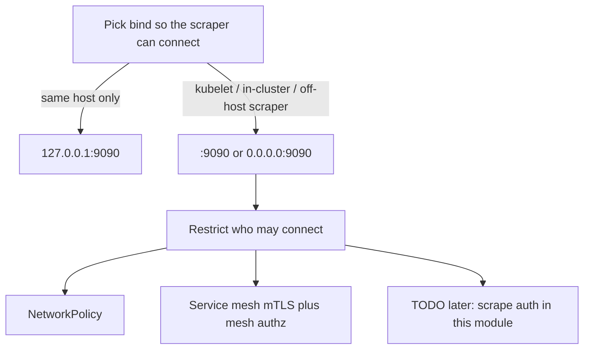

# caerus-framework-observability

[](https://github.com/caerus-framework/caerus-framework-observability/actions/workflows/ci.yml)
[](https://codecov.io/gh/caerus-framework/caerus-framework-observability)
[](LICENSE)


Caerus Framework — observability component.

Exposes:

- Kubernetes health-check endpoints aggregating every registered component that
  implements the optional
  [`caerusframework.HealthProvider`](https://github.com/caerus-framework/caerus-framework/blob/main/component.go)
  interface. Components that do not implement it are simply not included, so
  supporting health checks is entirely optional.
- A `/metrics` endpoint (Prometheus text format) with Go runtime metrics plus
  the live state of every registered component implementing the optional
  `cf.MetricsProvider` interface.
- OpenTelemetry tracing: when an OTLP endpoint is configured, the component
  builds a tracer provider, installs it as the global provider (components
  trace via `otel.Tracer`), and flushes it at `Shutdown`.

## Endpoints

| Endpoint | Probe | Behaviour |
|---|---|---|
| `/healthz`, `/livez` | liveness | `200 ok` while the process is alive; component health is deliberately excluded (a dependency outage should make a pod unready, not restartable). |
| `/readyz` | readiness (and startup) | `200 ok` when every registered `HealthProvider` component is healthy, `503` otherwise, with one `fail: <component>: <reason>` line per failing check. |
| `/metrics` | scrape | Prometheus text format: Go runtime + process metrics and one `<name>` sample per `MetricsProvider` component that has something to report. |

Kubernetes only inspects the status code: `2xx` = healthy, anything else =
unhealthy. Configure the probes in the pod spec, e.g.:

```yaml
livenessProbe:
  httpGet: { path: /healthz, port: 9090 }
  initialDelaySeconds: 3
  periodSeconds: 10
readinessProbe:
  httpGet: { path: /readyz, port: 9090 }
  initialDelaySeconds: 3
  periodSeconds: 5
```

Point a Prometheus scraper at `/metrics`, and a collector (e.g.
`otel-collector`) at the configured `trace_endpoint` for OTLP/gRPC spans.

## Wiring

Observability is **always-on core**, not a chassis component you list next to
postgres. `cf.New(&cf.FrameworkOptions{Observability: …})` registers it.
`RunWithSignals` (the serve path) starts its `Runnable`, which is when the
process binds the operator HTTP port.

### Golden path (app `main`)

```go
fw := cf.New(&cf.FrameworkOptions{
	Logs: &cf.LogsSettings{
		Format: "json", Level: "info", ConfigSource: "logs",
	},
	Observability: &cf.ObservabilitySettings{
		Bind:         ":9090", // /livez, /readyz, /metrics — bound in Run
		ConfigSource: "observability",
	},
	Components: []cf.CaerusComponent{
		// postgres, valkey, app, …
	},
})
if err := fw.RunWithSignals(ctx, cf.WithShutdownTimeout(15*time.Second)); err != nil {
	log.Fatal(err)
}
```

The seed’s `ConfigSource` is the configuration **source** name (file path
flag `--observability` when it is `"observability"`). The component
`Name()` is also `"observability"`. Prefer matching those two strings so
`GetDependencies` and the `--<name>` flag are the same word.

### Simple path (tests / one-off binary)

```go
fw := caerusframework.New() // no FrameworkOptions: add core by hand
fw.AddComponent(cf_logs.New(cf_logs.WithWriter(os.Stdout)))
fw.AddComponent(cf_observability.New()) // health + metrics, bind :9090 in Run
// ... register the rest of the components ...
fw.Run(ctx)
```

### Serving vs jobs

This component is the process’s **operator shop window** (`/livez`, `/readyz`,
`/metrics`). It is not the public API server (`caerus-framework-http` is).

`Init` prepares collectors, the mux, and the tracer. `Run` is the only place
that calls `net.Listen`. Framework jobs (`--postgresql.job=migrate`,
`fw.RunJob`) **never start `Runnable`s**, and observability is **not**
always initialized on a job (core job Init is logs + configuration). A
migrate Job therefore does not open `:9090`.

```text
Wrong: Init opens :9090 because “health must exist before Run.”
Right: Init prepares; Run binds. Jobs skip Runnables, so one-shot work has
       no operator HTTP.
```

Configure Kubernetes probes and Prometheus scrapes on **serving** pods, not
on Job pods. This module does **not** authenticate scrapes today (no bearer
token, no BasicAuth, no mTLS on `/metrics`). That is a **TODO for later**.
Until then, pick a bind the scraper can actually reach, then restrict who
may connect with NetworkPolicy and/or a service mesh.

### Bind and who may hit the shop window

`bind` is an ordinary listen address, the same kind of setting Prometheus
exporters (`node_exporter --web.listen-address`, Grafana Alloy, OTel
Collector) expose. This module does **not** pick a “safe” address for you.
You bind where the scraper and kubelet must connect; isolation is a
separate ops step.

Default is `:9090` (all interfaces, port 9090). That is the exporter
convention: omit the host, listen on every NIC. It is the right default
for Kubernetes serve pods and for an external scraper that must hit the
process. It is **not** “metrics are internal.” Anything that can route to
that address can GET `/metrics` unless you restrict it.



The bind choice and the isolation choice are two different questions.
Answer both. Do not collapse them into one sentence.

**Bind Path A — Reachable address (default, Kubernetes serve, external scraper)**

Use `:9090` or `0.0.0.0:9090`, or a specific NIC if you have one. Kubelet
probes hit the **pod IP**, not localhost. In-cluster Prometheus /
Prometheus Operator `ServiceMonitor` scrape the **pod IP** (or a Service
that forwards to it). An external scraper (Prometheus outside the cluster,
a vendor SaaS, a scrape from another VPC) also needs a reachable address
plus whatever Service / LoadBalancer / Ingress / hostNetwork you put in
front of the port.

```json
{ "bind": ":9090" }
```

Loopback (`127.0.0.1:9090`) is **overkill here and will not work**: the
scraper is not in this process’s network namespace. Binding loopback does
not “harden” a cluster scrape; it just makes kubelet and Prometheus fail
to connect.

**Bind Path B — Loopback (laptop / `go run` / sidecar on localhost)**

Use this only when the scraper (or a human curling `/metrics`) shares the
host with the process:

```json
{ "bind": "127.0.0.1:9090" }
```

Nothing off-box can connect. Do **not** use Bind Path B on a Kubernetes
serve pod if kubelet must probe `/readyz` or Prometheus must scrape
`/metrics`.

**Isolation Path A — Kubernetes NetworkPolicy (recommended for serve Deployments)**

After Bind Path A, allow **ingress TCP 9090** only from:

- the nodes / kubelet (liveness and readiness probes), and
- the namespace (or PodSelector) that runs Prometheus / Grafana Alloy.

Deny 9090 from the public Ingress and from app namespaces that have no
reason to scrape. A ClusterIP Service is **not** isolation — any pod that
can route to the pod IP can still connect. Put a Policy like this in the
**product Helm chart** (this module cannot enforce it):

```yaml
apiVersion: networking.k8s.io/v1
kind: NetworkPolicy
metadata:
  name: observability-shop-window
spec:
  podSelector:
    matchLabels:
      app: myapp          # serving pods only, not migrate Jobs
  policyTypes: [Ingress]
  ingress:
    - from:
        - namespaceSelector:
            matchLabels:
              name: monitoring   # Prometheus / Alloy
        # kubelet probes often come from the node; some CNIs need:
        # - ipBlock: { cidr: <node-pod-CIDR or hostNetwork> }
      ports:
        - protocol: TCP
          port: 9090
```

Adjust labels, namespaces, and the kubelet `from` rule to the cluster’s
CNI. Some meshes (see Isolation Path B) replace or sit beside this Policy;
the example is the default Kubernetes-only shape.

**Isolation Path B — Service mesh**

If the cluster already runs a mesh (Istio, Linkerd, Cilium mTLS, and so
on), you can require mTLS on port 9090 and allow only the Prometheus
identity (PeerAuthentication / AuthorizationPolicy, or the mesh’s
equivalent). This module does **not** configure the mesh. Mesh authz is
an extra isolation layer, not a second bind address, and not scrape auth
inside `cf_observability`.

**Later — scrape auth in this module (TODO)**

Bearer tokens, BasicAuth, or process-local mTLS on `/metrics` are **not
implemented**. Do not expect this binary to check a scrape secret today.
Track that as a later design; until then Isolation Path A and/or B are
the protection.

```text
Wrong: bind 127.0.0.1:9090 in Kubernetes so /metrics is “safe”, then
       expect kubelet or an external Prometheus to scrape the pod.
Right: Bind Path A (`:9090`) so the scraper can connect, then Isolation
       Path A (NetworkPolicy) and/or Isolation Path B (mesh).

Wrong: all-interfaces bind and no Policy, then treating /metrics as
       internal because the Service is ClusterIP.
Right: Bind Path A plus a Policy (and/or mesh). ClusterIP is not a
       firewall.

Wrong: waiting for scrape auth in this module before shipping a serve
       chart.
Right: ship the NetworkPolicy (Isolation Path A) now; scrape auth is a
       later TODO.
```

### Optional component health checks

A component opts in by implementing `cf.HealthProvider`; the observability
component discovers it and folds its health into `/readyz`:

```go
// Health implements cf.HealthProvider. nil = healthy.
func (c *CFMongoDB) Health(ctx context.Context) error {
    return c.pool.Ping(ctx) // or any other liveness/readiness signal
}
```

Every check is bounded by the health-check timeout (default `2s`); a component
that misses its deadline is reported as `timed_out` so a hung check can never
hang the probe.

### Optional component metrics (lazy pickup)

A component opts in by implementing `cf.MetricsProvider`; observability
registers a collector for it and reads `Metrics()` on every `/metrics` scrape,
so the values are always live:

```go
// Metrics implements cf.MetricsProvider.
func (l *Logs) Metrics() []cf.Metric {
    return []cf.Metric{{
        Name:  "logs_info", // served as logs_info
        Value: 1,
        Labels: map[string]string{"format": l.format.String(), "level": l.Level().String()},
    }}
}
```

Return `nil` while the component is not initialized (or has nothing to report):
the collector then skips it, and the sample appears on the scrape after the
component initializes — a lazy pickup with no subscription. Components that do
not implement the interface contribute nothing.

### Tracing

With an endpoint configured, `Init` creates an OTLP/gRPC tracer provider
and installs it as the global provider; components trace through
`otel.Tracer`. `Shutdown` flushes pending spans. OTLP uses **TLS** by
default. Set `trace_insecure: true` only when the collector has no TLS
(you are admitting cleartext).

**Sampling:** head sampling in this process. Default `trace_sample_ratio`
is **1.0** (every new trace is kept; same volume as the old AlwaysSample).
Set `0.1` to keep about 10% of new traces. Children follow the parent
(`ParentBased`): if the incoming trace was sampled, this process still
records the child. `0` means new traces are not sampled. This is not
TLS (`trace_insecure`) and not `/metrics`.

## Configuration

`ObservabilityConfig` is file/env-drivable: load it through the configuration
component and pass it via `WithConfig`:

```yaml
observability:
  health_checks: true          # enable the health-check endpoints
  metrics: true                # enable the /metrics endpoint
  tracing: true                # enable OTLP trace export (needs trace_endpoint)
  bind: ":9090"                # string = one listener; array = multibind
  health_check_timeout_sec: 2  # per-component health check deadline
  trace_endpoint: "otel-collector:4317"
  trace_insecure: false        # default TLS; set true to admit cleartext OTLP
  trace_sample_ratio: 1.0      # 1 = all new traces; 0.1 ≈ 10%; children follow parent
  service_name: myapp          # service.name on exported spans
```

| Option | Default | Purpose |
|---|---|---|
| `WithHealthChecks(bool)` | `true` | Enable the Kubernetes health-check endpoints. |
| `WithMetrics(bool)` | `true` | Enable the `/metrics` endpoint. |
| `WithTracing(bool)` | `false` | Enable trace export (active once an endpoint is set). |
| `WithBind(...string)` | `":9090"` (all interfaces) | Listen address(es) you choose — same idea as other exporters. Loopback (`127.0.0.1:9090`) is laptop/sidecar only; cluster and external scrapers need a reachable bind. |
| `WithHealthCheckTimeout(d)` | `2s` | Deadline for each component health check. |
| `WithTraceEndpoint(string)` | `""` (tracing latent) | OTLP/gRPC collector endpoint. |
| `WithTraceInsecure(bool)` | `false` (TLS) | Admit cleartext OTLP. |
| `WithTraceSampleRatio(float64)` | `1.0` | Head sampling 0–1 (`ParentBased` + ratio). |
| `WithServiceName(string)` | `"caerus"` | `service.name` attribute on exported spans. |
| `WithConfig(ObservabilityConfig)` | — | Loaded config overlay. Pointer switches keep construct values when omitted; `trace_insecure` is always copied (false clears `WithTraceInsecure(true)`). |
| `WithConfigSource(string)` | `""` | Bind a configuration source; `Init` applies its current value and `OnConfigReload` applies later changes live (tracing) or logs restart-required (bind/metrics/health toggles). |
| `WithLogger(*slog.Logger)` | framework `logs` logger (re-delivered on `logs` `Reconfigure`), falling back to `slog.Default()` | Explicit logger override. |

`health_checks`, `metrics` and `tracing` are `*bool` in `ObservabilityConfig`
so an explicit `false` in the file is honored (turning the feature off) instead
of being treated as "unset".

`trace_insecure` is a plain `bool`, not a pointer. Overlay **always assigns
it**. Default and omitted JSON/YAML keys unmarshal as `false`, which means
**TLS** — and that **clears** a construct `WithTraceInsecure(true)`. Set
`"trace_insecure": true` in the file (or `OBSERVABILITY_TRACE_INSECURE=true`)
when the collector has no TLS. This is intentional: we would rather an omitted
key turn cleartext **off** than leave a construct-time insecure option stuck
on after a reload.

```text
Wrong: WithTraceInsecure(true) plus a config file that omits
       trace_insecure, expecting cleartext OTLP to stay on.
Right: put "trace_insecure": true in the file if the collector is
       still cleartext; omit (or false) to force TLS.
```

## Component contract

Implements `caerusframework.CaerusComponent` and `cf.Runnable`:

- `Name()` → `"observability"` (`cf_observability.ComponentName`)
- `GetInitOrderStage()` → `caerusframework.ObservabilityStage` (third bootstrap
  stage, after logs and configuration)
- `GetDependencies()` → `[logs]` (plus `configuration` when `WithConfigSource`
  is set)
- `Init` sets up the Prometheus registry (Go/process collectors + one collector
  per registered `MetricsProvider`), builds and installs the tracer provider
  when tracing is enabled and an endpoint is configured, and builds the HTTP
  mux when health checks or metrics are enabled. It does **not** bind a listen
  address. With everything disabled it is a no-op besides logger subscribe.
- `Run` binds the HTTP server (fail-fast on an unusable address) and serves
  until the framework cancels the run context. Jobs never call `Run`.
- `Shutdown` stops the server if one is running, waiting for in-flight
  requests up to `ctx`, and flushes the tracer provider.
- `Address()` returns the bound address (empty when disabled, before `Run`,
  or after shutdown) for building probe configs at runtime.
- `TracerProvider()` returns the configured provider (nil when tracing is
  inactive).

## Docs

- [ARCHITECTURE.md](https://github.com/caerus-framework/caerus-framework/blob/main/docs/ARCHITECTURE.md)
  — component model and stage ordering.
- [LIFECYCLE.md](https://github.com/caerus-framework/caerus-framework/blob/main/docs/LIFECYCLE.md)
  — lifecycle guarantees.

## License

Apache License 2.0 — see [LICENSE](LICENSE).
